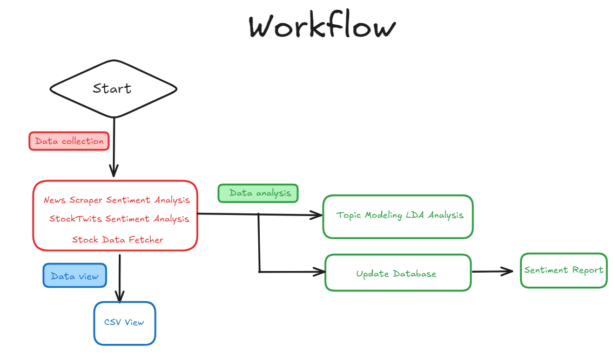

# 📊 TrendTeller Stock Insights 📈

**TrendTeller Stock Insights** is a powerful application that leverages natural language processing (NLP) and financial data analysis to provide actionable insights into stock market trends. It performs sentiment analysis on news headlines and StockTwits comments, while also identifying key topics through LDA (Latent Dirichlet Allocation) topic modeling. By correlating sentiment data with stock price movements and trading volume, the application aids investors and analysts in making data-driven decisions.

## 🗂️ Table of Contents
1. [Overview](#🌟-overview)
2. [Key Features](#🚀-key-features)
3. [Applications](#🛠️-applications)
    - [CSV Viewer](#🗃️-csv-viewer)
    - [News Scraper Sentiment Analysis](#📰-news-scraper-sentiment-analysis)
    - [Stock Data Fetcher](#📅-stock-data-fetcher)
    - [StockTwits Comment Sentiment Analysis](#💬-stocktwits-comment-sentiment-analysis)
    - [Topic Modeling LDA Analysis](#🧩-topic-modeling-lda-analysis)
    - [Sentiment Report](#🔗-Sentiment-Report)
4. [Database Schema](#🗃️-database-schema)
5. [Installation](#⚙️-installation)
6. [Usage](#▶️-usage)


## 🌟 Overview
TrendTeller Stock Insights integrates sentiment analysis, topic modeling, and financial data to help investors better understand market dynamics. It processes data from StockTwits and news sources, providing a clearer view of stock sentiment and potential price movements. The application also offers tools for data visualization and comprehensive correlation analysis.



## 🚀 Key Features
- **🧠 Sentiment Analysis**: Analyze market sentiment through news headlines and StockTwits comments.
- **📚 Topic Modeling**: Identify key topics within news and comments using LDA.
- **📈 Correlation Analysis**: Examine relationships between sentiment, stock prices, and trading volume.
- **📊 Data Visualization**: View trends using interactive charts and graphs.
- **🗄️ Database Management**: Store and manage comments and news headlines in an SQLite database.

## 🛠️ Applications

### 🗃️ CSV Viewer
- **Description**: View CSV files containing StockTwits comments and news data.
- **Functionality**: Users can browse and display CSV files from the `dataset/news` and `dataset/comments` folders.

### 📰 News Scraper Sentiment Analysis
- **Description**: Scrapes news from Google News for the past 24 hours, analyzes sentiment, and saves the results as a CSV file.
- **Functionality**: Users can input stock tickers and receive sentiment scores along with lemmatized news headlines.

### 📅 Stock Data Fetcher
- **Description**: Fetches historical stock data from Yahoo Finance for a specified ticker and date range.
- **Functionality**: Users can visualize stock price trends using candlestick charts and save the data as a CSV file.

### 💬 StockTwits Comment Sentiment Analysis
- **Description**: Analyzes sentiment from StockTwits comments uploaded by the user.
- **Functionality**: Users can upload a CSV of comments, and the application will clean, lemmatize, and analyze the sentiment of each comment.

### 🧩 Topic Modeling LDA Analysis
- **Description**: Performs topic modeling on the comments and news using LDA to extract key topics.
- **Functionality**: Users can select a CSV file and visualize word clouds for each topic identified in the data.

### 🔗 Sentiment Report
- **Description**: Allows users to analyze correlations between StockTwits and news sentiment, and stock price movements. Provides correlation metrics and visualizations to help understand the relationship between sentiment and financial data.
- **Functionality**: Users can input stock tickers and news search queries to fetch sentiment data from the database and correlate it with stock prices and trading volume.

## 🗃️ Database Schema
The application uses an SQLite database to store and manage data. The schema includes the following tables:

### Stocktwits_Comments
| Column Name  | Data Type    | Description |
|--------------|--------------|-------------|
| Username     | VARCHAR(256) | The username of the commenter |
| Comment      | TEXT         | The text of the comment |
| date         | DATE         | The date the comment was made |
| sentiment    | INT          | Sentiment score from sentiment analysis (1-5 scale) |
| Ticker       | VARCHAR(256) | The stock ticker associated with the comment |

### News
| Column Name    | Data Type    | Description |
|----------------|--------------|-------------|
| News Title     | TEXT         | The title of the news article |
| Date           | DATE         | The date the article was published |
| Source         | VARCHAR(256) | The source of the news article |
| URL            | TEXT         | The URL of the news article |
| sentiment      | INT          | Sentiment score from sentiment analysis (1-5 scale) |
| search_query   | VARCHAR(256) | The search query used to find the news article |

## ⚙️ Installation
1. Clone the repository:
   ```bash
   git clone https://github.com/HenryKong112/TrendTeller-Stock-Insights.git
   cd TrendTeller-Stock-Insights
   ```
2. Install required packages:

   Python Version: Python 3.12.4

   ```bash
   pip install -r requirements.txt
   pip install -U pip setuptools wheel
   python -m spacy download en_core_web_sm
   ```
3. Ensure you have SQLite installed for database management.

4. Install [Bardeen AI](https://chromewebstore.google.com/detail/bardeen-automate-browser/ihhkmalpkhkoedlmcnilbbhhbhnicjga?pli=1) for scrapping [Stocktwits](https://stocktwits.com/) comments.

## ▶️ Usage
1. Run the Streamlit application:
   ```bash
   streamlit run main.py
   ```
2. Access the application in your web browser at `http://localhost:8501`.


